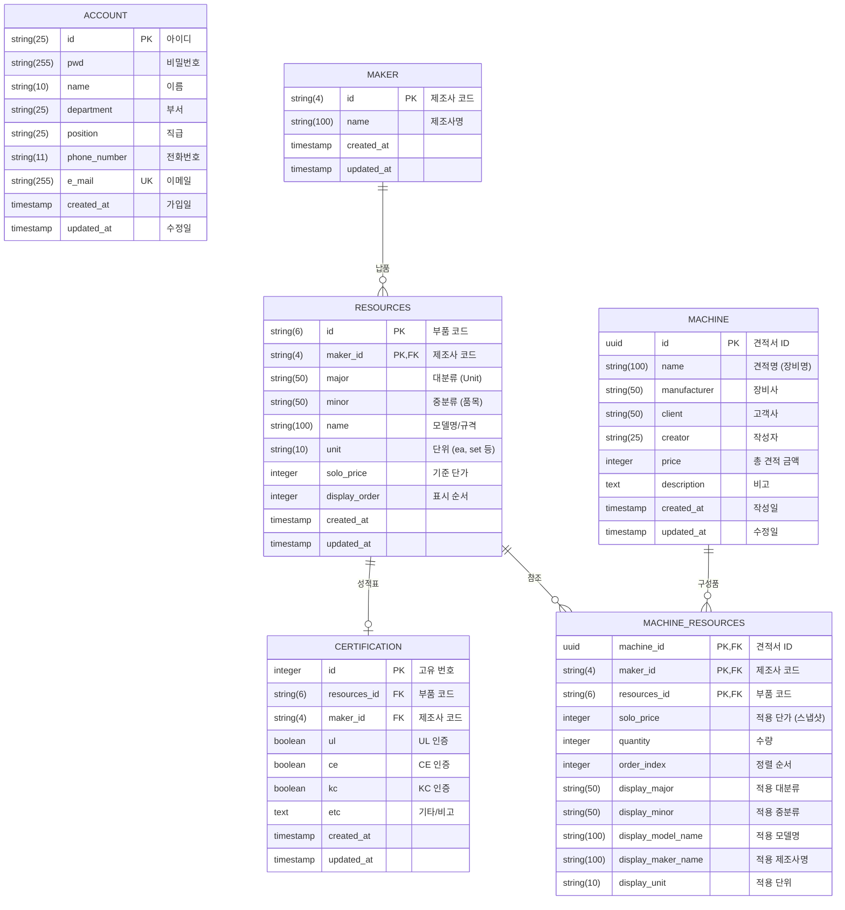

# SYNEX QUOTATION 데이터베이스 스키마

이 문서는 SYNEX QUOTATION 시스템의 데이터베이스 구조를 설명합니다. 시스템이 데이터를 어떻게 저장하고 연결하는지 이해하기 쉽게 정리했습니다.

## 개체 관계 다이어그램 (ERD)

---

## 테이블 상세 설명 (역할과 용도)

### 1. ACCOUNT (사용자 명부)
이 시스템을 사용하는 **직원들의 계정 정보**를 관리합니다.
*   **역할**: 로그인 인증, 견적 작성자 식별.
*   **주요 데이터**: 아이디, 이름, 부서, 직급, 연락처.

### 2. MAKER (제조사 목록)
부품을 생산하는 **브랜드(Maker) 리스트**입니다.
*   **역할**: 부품 등록 시 제조사를 선택하는 기준 정보.
*   **예시**: LS Electric, Siemens, 미쓰비시 등.
*   **특이사항**: `T000`(기타/공백), `LABOR`(인건비 전용) 같은 특수 코드도 포함됩니다.

### 3. RESOURCES (부품 마스터 / 상품 카탈로그)
견적에 사용할 수 있는 **모든 부품과 자재의 원장**입니다. '마트의 상품 진열대'와 같습니다.
*   **역할**: 견적 작성 시 검색하고 선택할 수 있는 기준 데이터.
*   **구조**: 제조사(`maker_id`)와 부품코드(`id`)가 합쳐져서 하나의 부품을 식별합니다.
*   **주요 데이터**: 대분류(Unit), 품목, 모델명, **기준 단가**.

### 4. CERTIFICATION (인증 정보)
각 부품(`RESOURCES`)이 보유한 **인증 내역(성적표)**을 별도로 관리합니다.
*   **역할**: 부품의 신뢰성 정보(UL, CE, KC 인증 여부) 저장.
*   **관계**: 부품 하나당 하나의 인증 정보가 1:1로 매칭됩니다.

### 5. MACHINE (견적서 헤더 / 프로젝트)
작성된 **하나의 견적서(또는 템플릿)** 자체를 의미합니다. '영수증의 머리말'과 같습니다.
*   **역할**: 견적의 기본 정보와 총액을 관리하는 껍데기.
*   **주요 데이터**: 견적명(장비명), 고객사, 작성자, **총 합계 금액**, 작성일.

### 6. MACHINE_RESOURCES (견적서 상세 품목 / BOM)
견적서(`MACHINE`) 안에 **실제로 어떤 부품이 몇 개 들어갔는지** 기록하는 상세 내역입니다. '영수증의 품목 리스트'입니다.
*   **역할**: 견적 구성 내역 저장 및 **작성 시점의 데이터 보존(스냅샷)**.
*   **스냅샷 기능**: 마스터(`RESOURCES`)의 가격이나 이름이 나중에 바뀌더라도, **이미 작성된 견적서는 작성 당시의 가격과 이름을 유지**해야 합니다. 그래서 이 테이블은 마스터를 단순히 가리키기만 하는 게 아니라, **당시의 가격(`solo_price`)과 이름(`display_*`)을 따로 복사해서 저장**합니다.
